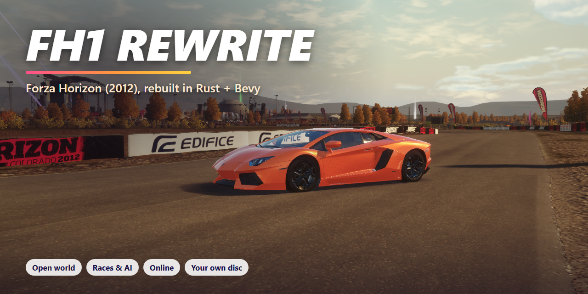

<p align="center">
  
</p>

<p align="center">
  <a href="https://github.com/Sm1jjj/fh1_rewrite/releases/latest"></a>
  
  
  
  
</p>

# FH1 Rewrite

A clean reimplementation of **Forza Horizon** (Xbox 360, 2012) in Rust and Bevy. Drive the Colorado open world with
the original cars, physics data, music and festival, rebuilt as a new PC engine. Bring your own disc: the installer
converts it on your machine, and nothing from the game is shipped here.

**What works today:** the full Colorado map with streaming scenery, props, crowds and traffic; 175 cars with their
own handling data, engine sounds and the in-game radio; races with AI drivers, wristband progression and credits;
a garage with paint, rims, body kits and upgrades; a PBR "remaster" renderer with time of day; and online free roam
on dedicated servers. Performance is a priority: the renderer is tuned for high frame rates, and a Console quality
preset targets low-end PCs (integrated graphics) at the original game's 720p. Parity with the original is the goal and still a work in progress.

## Play

1. [Download the latest release](https://github.com/Sm1jjj/fh1_rewrite/releases/latest) and unzip it anywhere with
   about 30 GB free.
2. Open **FH1 Rewrite.exe** and choose your Forza Horizon disc: the `.iso`, a `.zip` holding it, or the folder it's in.
3. Click **Install**, wait (up to an hour on slower PCs), then **PLAY**.

No Rust, Python or other tools needed. A gamepad is recommended; keyboard works too. The launcher updates itself
when a new release is out.

**Linux (experimental):** download `FH1Rewrite-<version>-linux-x64.tar.gz` from the same release, extract it and run
`./fh1-rewrite`. It's built automatically for every release and gets less testing than Windows.

### Graphics settings

Pause → **Options → Graphics**:

| Setting | Choices |
|---|---|
| Quality | **Console (720p)** for integrated graphics / older PCs, Low, Medium, High, Ultra. Sets shadows, draw distance, reflections, particles and crowd detail |
| Anti-aliasing | Off, FXAA, SMAA, SMAA + MSAA 2x (default), MSAA 2x, MSAA 4x |
| Motion blur | Off, Low, Medium (default), High |
| Render scale | 50-100 %, upscaled and sharpened |

Picking Console also switches to FXAA and turns motion blur off; you can change both afterwards.

### Got other Forza discs?

Forza Horizon is the only requirement. If you also own these Xbox 360 games, tick them in the installer to add
their content to the same game. Anything you don't own stays locked in the menus.

| Game | Adds |
|---|---|
| Forza Horizon 2 | 216 cars and the Southern Europe open world |
| Forza Motorsport 4 | 501 cars and 83 circuit layouts (a MOTORSPORT mode with grid, pit and flying starts) |
| Forza Motorsport 3 | coming later |

## Online

Pick **ONLINE** in the main menu. The official server and every public community server are listed with their map,
player count and ping, or use **Direct connect** with `host:port`. A server holds up to 24 players on one map.

Want to host? The server needs no game files and no GPU: see [`server/README.md`](server/README.md) (Ubuntu or
Windows, systemd units included).

## Controls

| | Keyboard | Gamepad |
|---|---|---|
| Throttle / brake | W / S | RT / LT |
| Steer | A / D | Left stick |
| Handbrake | Space | A |
| Shift up / down (manual) | E / Q | B / X |
| Clutch | Left Shift | LB |
| Rewind (hold) | X | Back |
| Reset car | R | Y |
| Camera | C | RB |
| Photo mode | F | |
| Radio station | , / . | D-pad left / right |
| Pause | Esc | Start |

## How it works

FH1 Rewrite is a new engine, not an emulator. The setup tool reads the game's own archives, models, textures,
database and audio from your disc and converts them into formats a modern engine can stream. Gameplay is then
rebuilt system by system from reverse-engineering research: the tyre model, drivetrain, brakes and steering are
checked against the original game running in a static recompilation, and the menus and HUD follow the original
layouts.

| Crate | Purpose |
|---|---|
| `fh1-formats` | Parsers: Forza zips (XMemCompress LZX), Xbox 360 textures, `.carbin` car models, scenery, PVS zones |
| `fh1setup` | Your disc → converted assets, per asset group, so updates only re-convert what changed |
| `fh1-launcher` | The installer and launcher (`FH1 Rewrite.exe`) |
| `fh1-engine` | The game: vehicle simulation, cameras, world streaming, races, AI, traffic, HUD and menus |
| `fh1-remaster` | The PBR renderer: static world on the GPU, shadows, sky, car paint, post |
| `fh1-shaders` / `fh1-render` | Xenos shader microcode → WGSL; shared render pieces (particles, sky, quality presets) |
| `fh1-world` | Track collision and surfaces |
| `fh1-audio` / `fh1-radio` | Engine sound from the game's FMOD banks, and the radio |
| `fh1-ui` | UI data: string tables, fonts, HUD scenes |
| `fh1-video` | FMV playback of the game's movies (intros, cutscenes) through an ffmpeg child process |
| `fh1-net` | Multiplayer protocol, game server and server list |

## Build from source

Requires Windows, Rust (stable, MSVC toolchain) and your own Forza Horizon disc.

```
cargo run --release -p fh1setup -- "path/to/Forza Horizon.iso"     # or an extracted disc folder
cargo run --release --no-default-features -p fh1-engine
```

`fh1-engine` compiles the Remaster RTX renderer (DLSS-RR) by default, which needs the NVIDIA DLSS SDK
(the `DLSS_SDK` environment variable), the Vulkan headers and libclang. Without those, build with
`--no-default-features` as above; the game then runs in its standard renderer. The `fh1setup` line keeps the
optional FH2/FM4 importers; drop to `--no-default-features` there for an FH1-only setup tool.

`fh1setup` also needs `ffmpeg` on `PATH` (or `FH1_FFMPEG` pointing at it): the `audio` group decodes the game's XMA
banks through it and setup stops there without it. The release ships a pinned build; source builds must supply their
own, and `fh1-engine` then uses the same ffmpeg for FMV playback.

The Xbox 360 retail XEX key is needed to read the shaders inside `default.xex`. Source builds look for it in
`data/xex_key.txt` or `FH1_XEX_KEY`; it is not part of this repository. Optional importers:

```
cargo run --release -p fh1setup --features fh2 -- import-fh2 "path/to/FH2.iso"
cargo run --release -p fh1setup --features fm4 -- import-fm4 "path/to/FM4 Play Disc.iso" --content "path/to/FM4 Content Install Disc.iso"
```

`tools\release.ps1` builds the Windows release zip. Vendored crates keep their own licenses: `vendor/lzxd` (patched for
XMemCompress streams), `vendor/bevy_pbr` (shadow cascade caching, cached bind groups, static atmosphere LUTs),
`vendor/wgpu-core` (bind group tracking once per pass / command buffer) and `vendor/bevy_solarik`; each patched crate
lists its changes in `FH1_PATCHES.md`.

## AI usage

This project was built with AI coding tools, working from the game's own data files and from reverse-engineering
research against the original game. Every format, number and behaviour is checked against the real disc or the
original running game before it is called verified. AI did the typing; the goal is still to understand how Forza
Horizon actually works, and parity is measured rather than assumed.

## Contributing

Contributions are welcome: open an issue or a pull request. By contributing you agree that your work is licensed under
the GPL-3.0 like the rest of the project.

## License

Copyright (c) 2026 Sm1jjj and the FH1 Rewrite contributors.

FH1 Rewrite is licensed under the [GNU General Public License v3.0 only](LICENSE) (`GPL-3.0-only`). You may use,
study, modify and share it, but if you distribute it or anything built from it, you must release your full source
under the same licence and keep the copyright notices. It may not be taken closed-source. Vendored third-party code
keeps its own licence.

This is an unofficial fan project, not affiliated with or endorsed by Microsoft, Xbox Game Studios, Turn 10 Studios
or Playground Games. Forza Horizon and all game content, names and trademarks belong to their owners. This repository
contains no game assets, keys or decompiled code; you need your own copy of the game.
